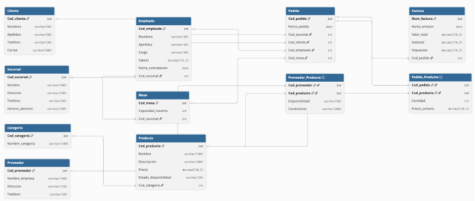

# 🍽️ Restaurant Management System Database


A complete relational database management system developed with SQL Server 2022 to support restaurant operations, including customers, employees, orders, products, suppliers and invoices.
---

## 📖 Overview

This project simulates the database of a restaurant management system.

The system manages:

- Customers/Users/user/Desktop/Entrega2bd/restaurant-management-database/database
- Employees
- Products
- Suppliers
- Orders
- Invoices
- Restaurant Tables

---

## 🎯 Learning Objectives

- Design a relational database.
- Apply normalization principles.
- Implement CRUD operations.
- Write SQL queries using JOIN operations.
- Generate reports using relational data.

---

## 🛠 Technologies

- SQL Server 2022
- Docker
- Visual Studio Code
- DBML

---

## 📂 Project Structure

```text
restaurant-management-database
│
├── database
│   ├── 01_create_tables.sql
│   ├── 02_insert_data.sql
│   ├── 03_queries.sql
│   └── 04_delete_data.sql
│
├── diagrams
│   └── er-diagram.png
│
├── docs
│   └── final-report.pdf
│
└── screenshots
```

## 🗄️ Entity Relationship Diagram



---

## 🚀 Installation

1. Create a database in SQL Server 2022.
2. Execute `01_create_tables.sql`.
3. Execute `02_insert_data.sql`.
4. Run the queries in `03_queries.sql`.

---

## 📌 Future Improvements

- Stored Procedures
- Triggers
- Views
- Index optimization
- Transactions

## 👨‍💻 Author

Miguel Ochoa